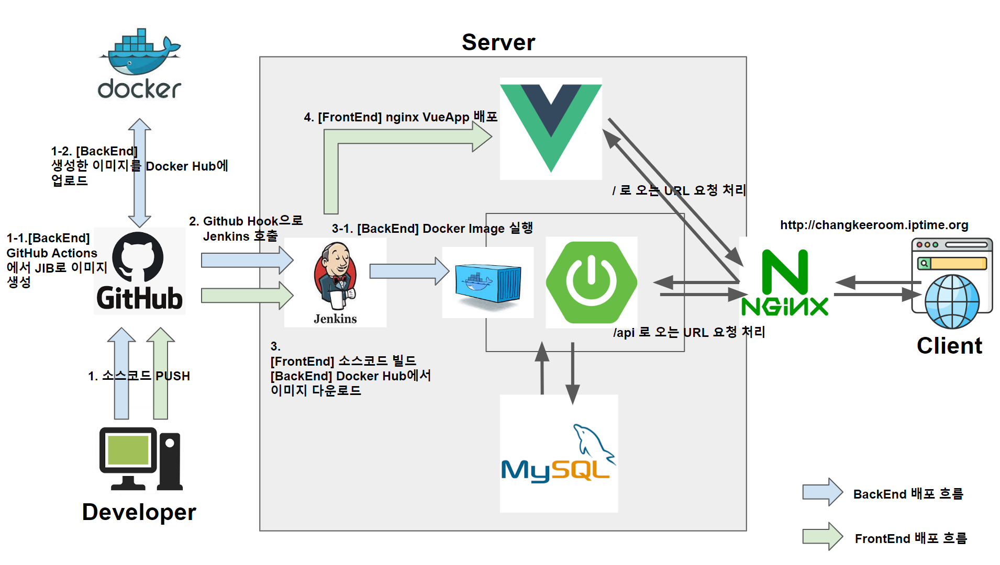

# 농구일기 BasketballDiary | Back-End

### 서비스 개요
> "우리 팀이 성장한 모습을 객관적으로 보고 싶어요." 
"경기에서의 나의 기여도와 강점을 파악하고 싶어요."

많은 동호회와 농구인들은 이 같은 욕구를 가지고 있습니다.
이를 위해 매 경기마다 기록지를 직접 작성하여 관리하기도 합니다.
하지만 매번 기록지를 출력하고, 기록하고, 엑셀로 관리하는 일은 번거롭기만 합니다.

"농구일기" 는 경기 중 경기 기록을 실시간으로 입력하여, 경기 기록을 손쉽게 관리할 수 있는 서비스를 제공합니다.
체계적인 기록 관리를 통해 나와 우리 팀의 성장을 지켜보세요.

 

### 주요 기능
- 팀을 새롭게 만들고, 함께하고자 하는 팀원들을 초대할 수 있습니다.
- 농구일기에 등록된 팀 중 함께하고 싶은 팀에게 가입요청을 보내 팀에 가입할 수 있습니다.
- 우리 팀끼리 경기하거나 상대팀과 함께한 경기도 기록할 수 있습니다.
- 진행했던 경기의 기록들을 선수별로 스탯을 입력할 수 있습니다.
- 입력된 경기결과를 팀별로, 쿼터별로 볼 수 있습니다.
> - APIDocs URL : http://changkeeroom.iptime.org:18080/swagger-ui/index.html

 

### 서비스 구성도

> - 개발서버 URL : http://changkeeroom.iptime.org/  
> - FrontEnd GitRepo URL : https://github.com/Yeo-injun/-basketballDiary-frontend  

### 기술적 이슈 및 해결
#### 1.
#### ...

### API 설계 원칙

### DB 설계 (ERD)

### 기술스택

